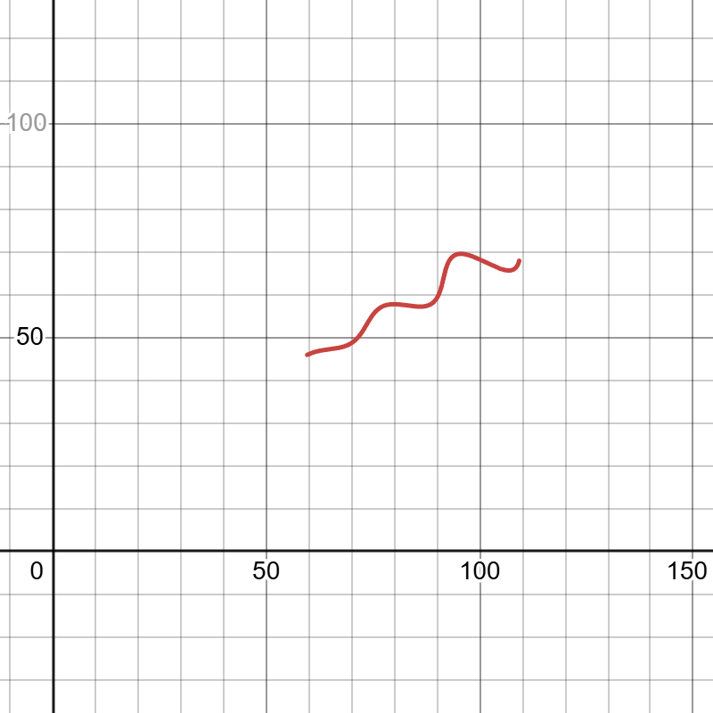
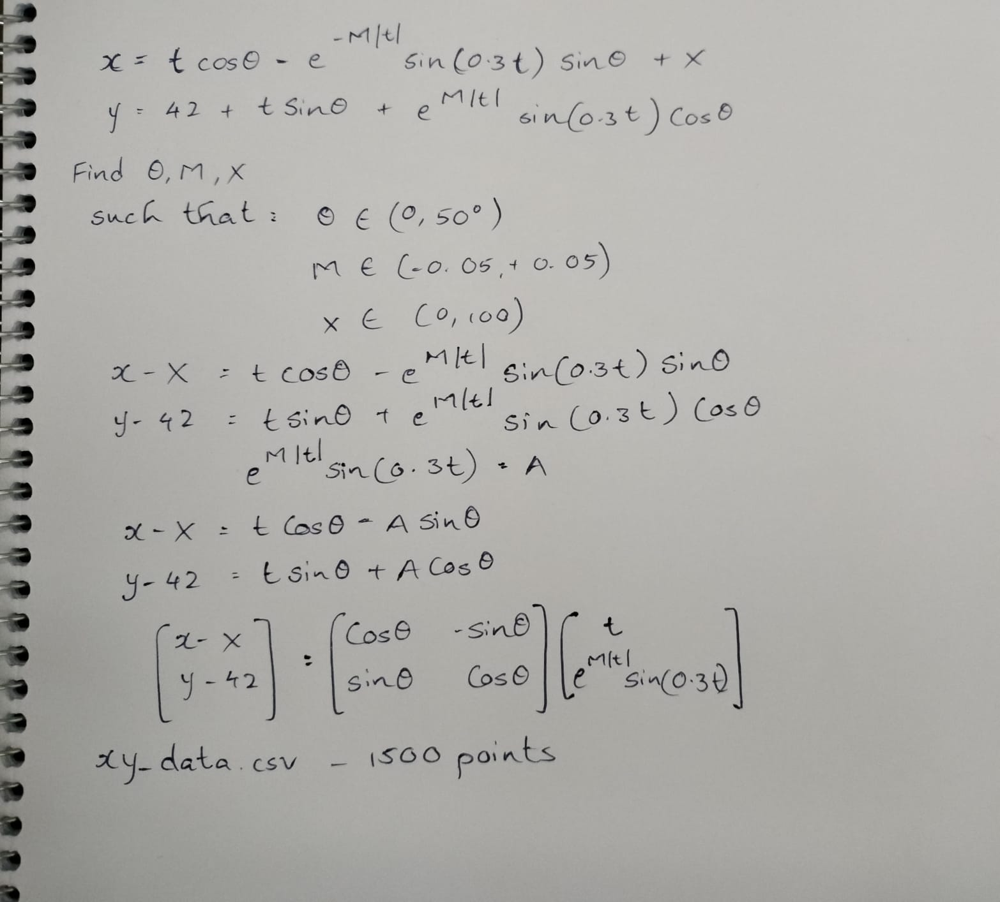
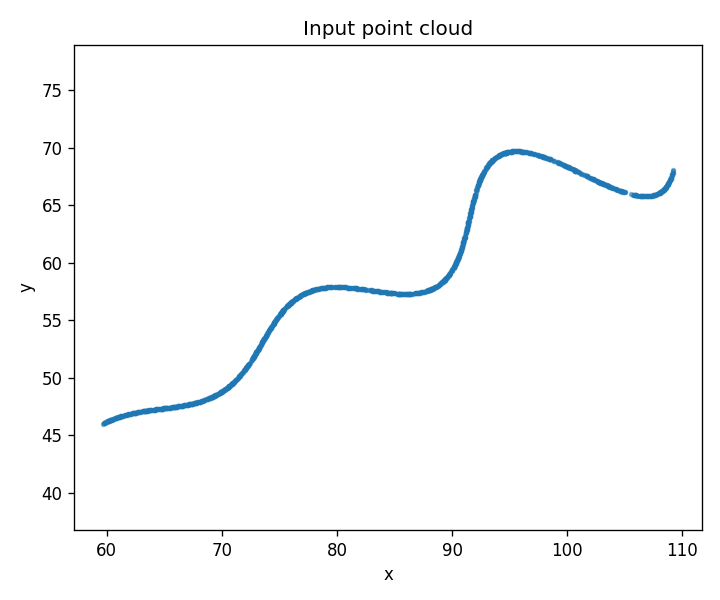
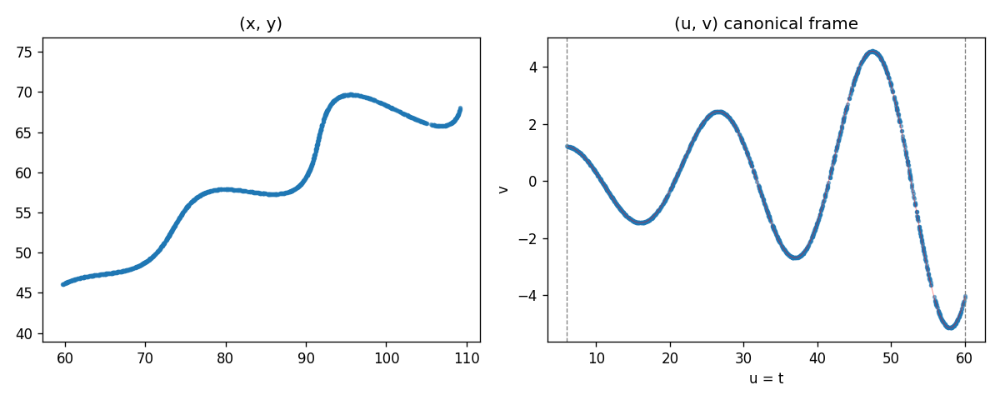
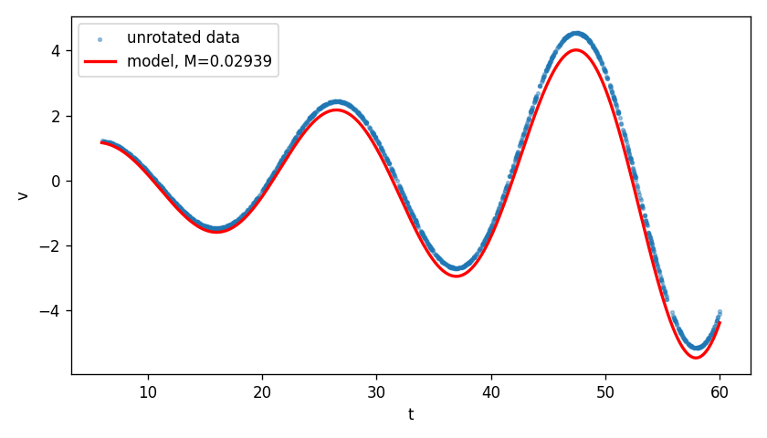

# Parametric Curve Parameter Estimation

Finding $\theta$, $M$, and $X$ from 1500 unordered points on a rotated parametric curve (`xy_data.csv`).

---

## Answer

| Parameter | Value |
|-----------|-------|
| $\theta$ | **0.5236 rad (30°)** |
| $X$ | **55.0** |
| $M$ | **0.030** |

### Desmos equation (submission format)

Paste into [https://www.desmos.com/calculator/rfj91yrxob](https://www.desmos.com/calculator/rfj91yrxob):

```
\left(t*\cos(0.5236)-e^{0.03\left|t\right|}\cdot\sin(0.3t)\sin(0.5236)+55,\ 42+t*\sin(0.5236)+e^{0.03\left|t\right|}\cdot\sin(0.3t)\cos(0.5236)\right)
```



---

## Problem

Each point in the CSV satisfies:

$$
\begin{pmatrix} x \\ y \end{pmatrix}
=
\begin{pmatrix} \cos\theta & -\sin\theta \\ \sin\theta & \cos\theta \end{pmatrix}
\begin{pmatrix} t \\ e^{M|t|}\sin(0.3t) \end{pmatrix}
+
\begin{pmatrix} X \\ 42 \end{pmatrix}
$$

for some unknown $t_i \in (6, 60)$. The rows are **not ordered** by $t$.

### Initial notes



*Rewriting the equation in matrix form to understand the rotation structure.*

---

## First attempt — brute force

My first thought was: if there are only three unknowns, just grid-search them.

I set up a 3D grid over $\theta \in [20°, 40°]$, $M \in [-0.05, 0.05]$, $X \in [45, 65]$, sampled the curve densely for each combination, and scored each triple by how close the data points were to the curve (mean minimum L1). This is `brute_force_search.py`.

It actually worked — pointed straight to $\theta \approx 30°$, $X \approx 55$, $M \approx 0.03$. But the grid was coarse (steps of 2° in $\theta$, 5 in $X$) and it had no way to enforce the $t \in [6, 60]$ constraint or assign which $t_i$ belongs to which point. Finer grids would be slow, and there was no real precision guarantee.

So I used brute force to confirm the neighbourhood, then built a proper pipeline to nail down the exact values.

---

## What I did (refined approach)

The main challenge is that each point has its own hidden $t_i$ — you can't just run a standard regression.

**Step 1 — PCA for a starting guess**
PCA on the point cloud gives the spine direction → $\theta \approx 28.5°$.

**Step 2 — Grid search over $(\theta, X)$**
For each candidate pair, I unrotate the points and check what fraction of $u_i$ fall in $[6, 60]$. The best result was $\theta = 29.5°$, $X = 55$ with 99.9% of points in range.

**Step 3 — Fit $M$**
After unrotating, the $v$ values should follow $e^{M|t|}\sin(0.3t)$. A simple 1D bounded minimisation gives $M \approx 0.0294$.

**Step 4 — EM refinement**
Alternate between assigning the nearest $t_i$ to each point and re-fitting $(\theta, X, M)$ with least squares. After 5 rounds RMSE dropped from ~0.18 to ~0.016, converging to the final values above.

**Step 5 — L1 check**
Sampled 500 points uniformly over $t \in [6, 60]$, found the nearest data point to each, and computed Manhattan distance. Mean L1 = **0.0263**.

Also did a brute-force 3D grid first as a sanity check — it landed on the same $(30°, 55, 0.03)$.

---

## Figures



*Raw point cloud — clearly a rotated, oscillating curve.*



*After unrotating by $\theta$: the sine-wave envelope with growing amplitude is clearly visible.*



*Fitted $v$ vs $t$ with $M = 0.0294$.*

---

## How to run

```bash
pip install numpy pandas matplotlib scipy
python plot_data.py
python pca_theta.py
python grid_search_theta_X.py
python fit_M.py
python refine_parameters.py
python l1_metric.py
```

Brute-force baseline:
```bash
python brute_force_search.py
```

---

## Files

| File | Purpose |
|------|---------|
| `xy_data.csv` | Input data |
| `curve_model.py` | Curve math, L1 metric |
| `brute_force_search.py` | 3D grid baseline |
| `pca_theta.py` | Initial $\theta$ estimate |
| `grid_search_theta_X.py` | Constraint-based grid search |
| `fit_M.py` | Fit $M$ from unrotated data |
| `refine_parameters.py` | EM refinement loop |
| `l1_metric.py` | Final L1 evaluation |
